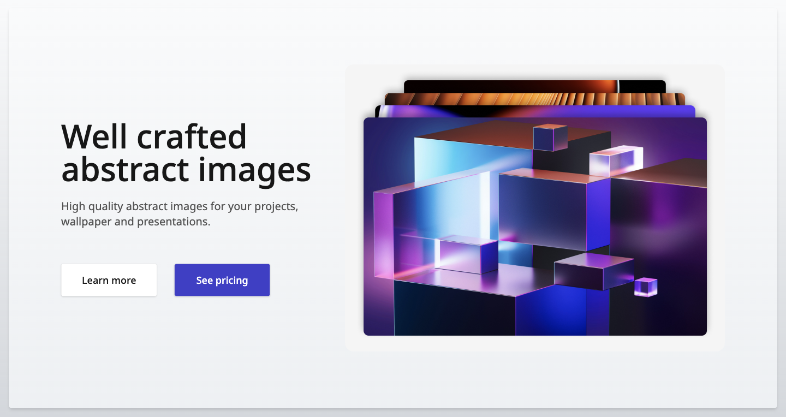
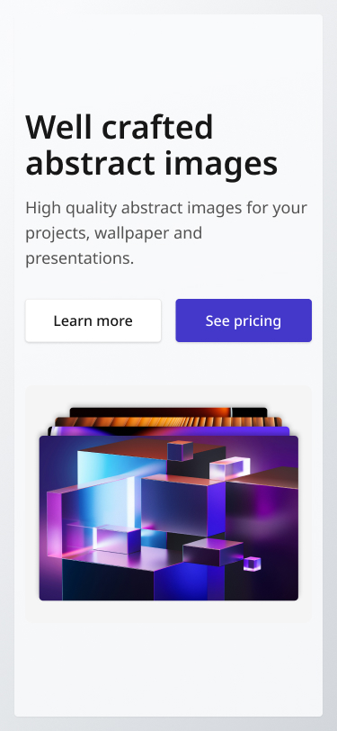

<!-- Use Ctrl/Cmd + Shift + V in VS Code to preview this Markdown file. -->

GreatFrontEnd Projects Challenge

# Hero Section Simple

## Overview

In this challenge, you will develop a simple, responsive hero section based on the provided designs for desktop, tablet, and mobile views. The hero section will have a basic layout with one image on the side.

## Implementation requirements

- Design fidelity: Aim to follow the design as closely as possible. All elements in the design should be present, using the specified text color, font size, font weight, spacing, dimensions, etc.
- Cross-browser compatibility: Check that your solution works for major browsers including Chrome, Firefox and Safari.
- [Stretch goal] Handle long strings: In reality, the person's name and testimonial can be extremely long. The UI should be able to accommodate extremely long strings by either wrapping to the next line, truncating, or both.
- [Stretch goal] Performance optimization: Optimize image assets and code for quick load times, ensuring a smooth and responsive user experience.
- [Stretch goal] Accessibility and semantics: Follow best practices for web accessibility, such as using semantic HTML and ARIA roles where necessary and using proper alt tags for images.

### Screenshot

